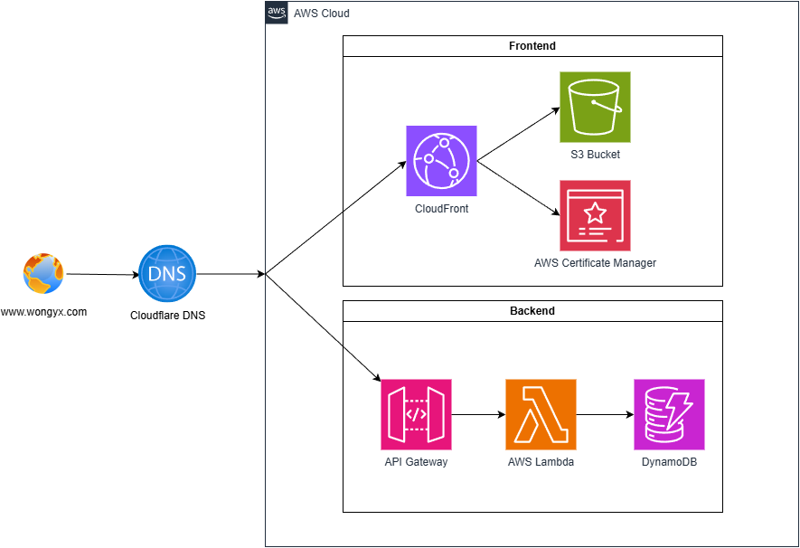
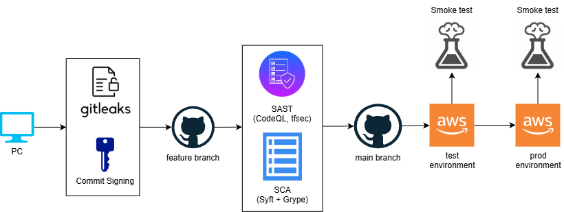

# ☁️ Cloud Resume Challenge

This is my attempt at the Cloud Resume Challenge, a serverless resume website deployed on AWS, built to demonstrate practical skills in cloud infrastructure, CI/CD automation, and DevSecOps practices.

The website can be found at: [www.wongyx.com](https://www.wongyx.com)

---

## 📐 Architecture Overview

---

## 🛠️ Technologies Used

### Cloud Infrastructure
- **Amazon Web Services** — S3, CloudFront, API Gateway, Lambda, DynamoDB, Certificate Manager

### Infrastructure as Code
- **Terraform** — manages all infrastructure with:
  - Separate test and production environments
  - Remote state stored in Amazon S3
  - State locking via Amazon DynamoDB

### CI/CD Pipeline
- **GitHub Actions** — automates security scanning, infrastructure deployment, and application updates

---

## 🔒 Security & DevSecOps

Security controls are integrated directly into the CI/CD pipeline.

### Static Application Security Testing (SAST)
- **GitHub CodeQL** — scans the Python codebase for vulnerabilities before code is merged

### Infrastructure Security Scanning
- **tfsec** — detects misconfigurations and insecure Terraform definitions

### Software Composition Analysis (SCA)
- **Syft** — generates a Software Bill of Materials (SBOM) in CycloneDX format
- **Grype** — scans the SBOM for known dependency vulnerabilities

### CI/CD Security Controls
- Security scans run automatically on every pull request
- Merges are blocked if high or critical vulnerabilities are detected
- Dependency vulnerabilities are checked before deployment

### Secure Authentication (OIDC)
The pipeline authenticates to AWS using **OpenID Connect (OIDC)** via GitHub Actions and AWS IAM, which:
- Eliminates the need for stored, long-lived access keys
- Uses short-lived, scoped credentials per workflow run
- Reduces the risk of credential leakage

### Principle of Least Privilege
IAM permissions are tightly scoped:
- Fine-grained policies limit access to only required resources
- Read-only IAM access is used for Terraform
- Minimises blast radius in the event of a compromised workflow

---

## 🎯 Project Goals

This project was built to explore:
- Cloud infrastructure design on AWS
- Infrastructure as Code with Terraform
- CI/CD automation with GitHub Actions
- DevSecOps practices and tooling

It serves as a hands-on demonstration of integrating security controls directly into a modern cloud deployment workflow.

---

## 🙏 Acknowledgements

Based on the [Cloud Resume Challenge](https://cloudresumechallenge.dev/), created to help engineers develop practical cloud skills through real-world projects.